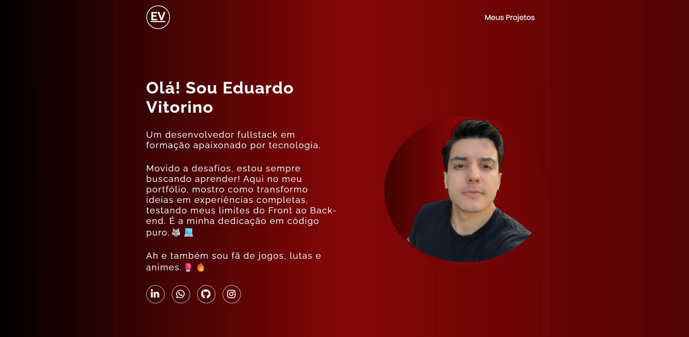
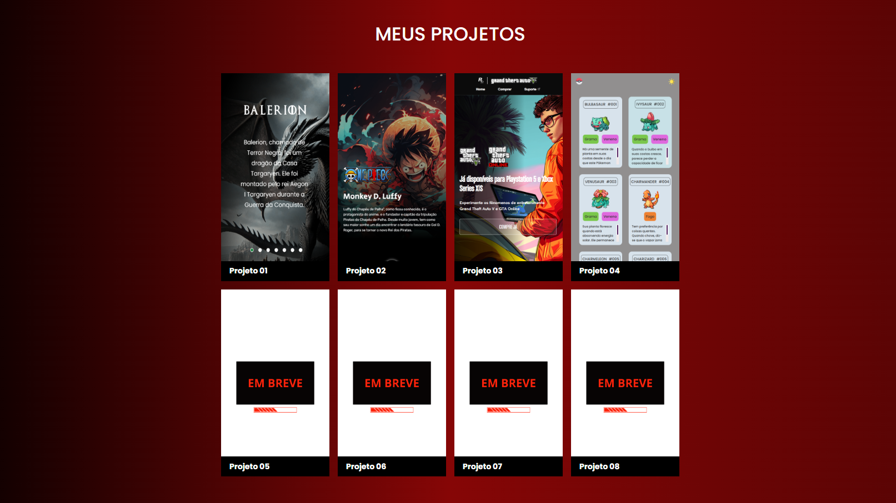

<div align="center">
  
  # 👨‍💻 Portfólio Pessoal Simplificado | Eduardo Vitorino

  Meu portfólio pessoal construído para apresentar minha trajetória, minhas habilidades como Desenvolvedor Fullstack em formação e, claro, meus melhores projetos em código puro. 🐺💻

  
  

</div>

<br>

<div align="center">
  
</div>

<br>

## 📌 Índice
- [Visão Geral](#-visão-geral)
- [Funcionalidades](#-funcionalidades)
- [Tecnologias Utilizadas](#-tecnologias-utilizadas)
- [Demonstração](#-demonstração)
- [Como Executar o Projeto](#-como-executar-o-projeto)
- [Autor](#-autor)

---

## 📖 Visão Geral
Este projeto é a minha página de apresentação na web. O objetivo central é ter um espaço centralizado, elegante e direto ao ponto para que recrutadores e outros desenvolvedores possam conhecer o meu trabalho. O layout foi pensado para ser imersivo, utilizando tons escuros e um gradiente vermelho animado que reflete a minha identidade visual.

---

## ✨ Funcionalidades
- **Layout Responsivo:** A página adapta-se perfeitamente a monitores ultra-wide, laptops, tablets e smartphones (Mobile First / Media Queries).
- **Interatividade Dinâmica:** Botão "Mostrar Mais" que revela novos projetos na grade de forma dinâmica utilizando JavaScript.
- **Animações CSS:** Fundo com efeito de gradiente em movimento contínuo (`@keyframes`) e transições suaves ao passar o mouse sobre os projetos.
- **Links Sociais:** Acesso rápido ao LinkedIn, GitHub, WhatsApp e Instagram.

---

## 🛠 Tecnologias Utilizadas

Este projeto foi desenvolvido com as seguintes tecnologias web clássicas:

<div align="center">
  
  
  
  

</div>

*Também foram utilizadas bibliotecas de ícones de terceiros, como **FontAwesome** e **DevIcons**.*

---

## 🖥 Demonstração

> 
> 

Você também pode acessar o projeto online através do GitHub Pages:
🔗 **[Acessar o Portfólio Online](https://vitorinolabs.site/Portfolio-simplificado/)** *(Lembre-se de ajustar este link)*

---

## 🚀 Como Executar o Projeto

Caso queira baixar e rodar este projeto na sua máquina localmente, siga os passos abaixo:

1. **Clone este repositório:**
   ```bash
   git clone https://github.com/vitorinoeduard/Portfolio-simplificado.git
   ```

2. **Acesse a pasta do projeto:**
   ```bash
   cd NOME-DO-SEU-REPOSITORIO
   ```

3. **Abra no seu editor de código (Ex: VS Code):**
   ```bash
   code .
   ```

4. **Execute no navegador:**
   Utilize a extensão **Live Server** no VS Code para abrir o arquivo `index.html`, ou simplesmente dê um duplo clique no arquivo `index.html` pelo seu gerenciador de arquivos.

---

## 🦸‍♂️ Autor

Desenvolvido com muita dedicação por **Eduardo Vitorino Braga**. Movido a desafios, jogos, lutas e animes! 🥊🔥

Entre em contato comigo:

[](https://www.linkedin.com/in/deveduardovitorino/)
[](https://wa.me/+5531997520126)
[](https://github.com/vitorinoeduard)
[](https://www.instagram.com/eduarvitorino/)

---
<p align="center">Feito com 💡 e ☕</p>
